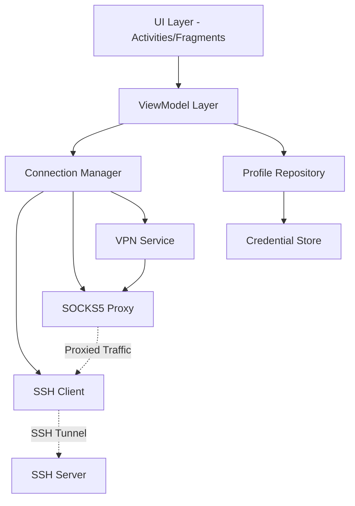

# Design Document

## Overview

SSH Tunnel Proxy is a mobile application (initially Android, with future iOS support planned) that establishes SSH tunnels to user-controlled servers and routes device traffic through SOCKS5 proxies. The application leverages platform VPN APIs to intercept and redirect traffic without requiring root access, while maintaining strong security through key-based SSH authentication and encrypted credential storage.

The architecture follows a layered approach with clear separation between platform-agnostic business logic and platform-specific implementations. Core components (SSH connection management, profile persistence, reconnection logic) are designed to be shared across platforms using Kotlin Multiplatform, while platform-specific code (VPN APIs, UI, credential storage) remains isolated behind well-defined interfaces. This design enables maintainability, testability, and future cross-platform extensibility (such as iOS support and HTTP proxy support post-MVP).

## Architecture

### Multiplatform Strategy

The application is designed with Kotlin Multiplatform to enable future iOS support while maintaining a single codebase for business logic. The architecture separates concerns into three layers:

1. **Shared Module (commonMain)**: Business logic, data models, repositories, connection management
2. **Platform Modules (androidMain/iosMain)**: Platform-specific implementations (VPN APIs, credential storage, SSH clients)
3. **UI Layer**: Platform-native UI (Jetpack Compose for Android, SwiftUI for iOS)

**Benefits**:
- ~70-80% code reuse between platforms
- Single source of truth for business logic
- Easier testing (test shared logic once)
- Consistent behavior across platforms
- Faster iOS development when needed

**Trade-offs**:
- Initial setup complexity
- Need to learn Kotlin Multiplatform patterns
- Some platform-specific code duplication
- Dependency management across platforms

### High-Level Architecture



### Component Layers

1. **Presentation Layer** (Platform-Specific): 
   - Android: Activities, Fragments, ViewModels using MVVM pattern
   - iOS (Future): SwiftUI Views, ViewModels
2. **Business Logic Layer** (Shared - Kotlin Multiplatform): 
   - Connection management, reconnection logic, profile management
   - Connection state machine, retry logic, profile validation
3. **Infrastructure Layer** (Mixed):
   - Shared: SSH client interface, connection abstractions
   - Platform-Specific: VPN service, credential storage implementations
4. **Data Layer** (Shared - Kotlin Multiplatform): 
   - Profile persistence using SQLDelight
   - Credential storage interface with platform implementations

### Technology Stack

**Shared (Kotlin Multiplatform)**:
- **Language**: Kotlin Multiplatform
- **SSH Library**: Platform-specific implementations behind common interface (JSch for Android, NMSSH/Citadel for iOS)
- **Storage**: SQLDelight for cross-platform database
- **Concurrency**: Kotlin Coroutines and Flow
- **Networking**: Ktor for HTTP requests (connection testing)

**Android-Specific**:
- **VPN**: Android VpnService API
- **Credential Storage**: Android Keystore
- **DI**: Hilt for dependency injection
- **UI**: Jetpack Compose with Material Design 3

**iOS-Specific (Future)**:
- **VPN**: NetworkExtension framework (NEPacketTunnelProvider)
- **Credential Storage**: iOS Keychain
- **DI**: Swift dependency injection or Kotlin/Native DI
- **UI**: SwiftUI

## Components and Interfaces

### 1. SSH Connection Manager (Shared - Kotlin Multiplatform)

**Responsibility**: Establishes and maintains SSH connections, creates SOCKS5 tunnels

```kotlin
// Shared interface (commonMain)
interface SSHConnectionManager {
    suspend fun connect(profile: ServerProfile): Result<Connection>
    suspend fun disconnect()
    fun observeConnectionState(): Flow<ConnectionState>
    suspend fun testConnection(): Result<ConnectionTest>
}

data class Connection(
    val sessionId: String,
    val socksPort: Int,
    val serverAddress: String
)

sealed class ConnectionState {
    object Disconnected : ConnectionState()
    object Connecting : ConnectionState()
    data class Connected(val connection: Connection) : ConnectionState()
    data class Error(val error: ConnectionError) : ConnectionState()
}

// Platform-specific SSH client interface
expect interface SSHClient {
    suspend fun connect(host: String, port: Int, username: String, privateKey: ByteArray): Result<SSHSession>
    suspend fun createPortForwarding(session: SSHSession, localPort: Int): Result<Int>
    suspend fun disconnect(session: SSHSession)
    suspend fun sendKeepAlive(session: SSHSession)
}

// Android implementation (androidMain)
actual class AndroidSSHClient : SSHClient {
    // Uses JSch library
    // session.setPortForwardingL(localPort, remoteHost, remotePort)
}

// iOS implementation (iosMain) - Future
actual class IOSSSHClient : SSHClient {
    // Uses NMSSH or Citadel library
}
```

**Implementation Details**:
- Core connection logic is platform-agnostic (shared)
- Platform-specific SSH implementations use native libraries
- Manages SSH session lifecycle and keep-alive packets
- Handles authentication using private keys (RSA, ECDSA, Ed25519)

### 2. VPN Tunnel Provider (Platform-Specific)

**Responsibility**: Routes device traffic through the SOCKS5 proxy

```kotlin
// Shared interface (commonMain)
interface VpnTunnelProvider {
    suspend fun startTunnel(config: TunnelConfig): Result<Unit>
    suspend fun stopTunnel(): Result<Unit>
    suspend fun updateRouting(config: RoutingConfig): Result<Unit>
    fun observeTunnelState(): Flow<TunnelState>
}

data class TunnelConfig(
    val socksPort: Int,
    val dnsServers: List<String>,
    val routingConfig: RoutingConfig
)

data class RoutingConfig(
    val excludedApps: Set<String>,
    val routingMode: RoutingMode
)

sealed class TunnelState {
    object Inactive : TunnelState()
    object Starting : TunnelState()
    object Active : TunnelState()
    data class Error(val error: String) : TunnelState()
}

// Android implementation (androidMain)
actual class AndroidVpnTunnelProvider(
    private val vpnService: VpnService
) : VpnTunnelProvider {
    // Uses Android VpnService API
    // Creates TUN interface, routes through SOCKS5
    // Uses addDisallowedApplication() for exclusions
}

// iOS implementation (iosMain) - Future
actual class IOSVpnTunnelProvider : VpnTunnelProvider {
    // Uses NetworkExtension framework
    // NEPacketTunnelProvider for packet routing
}
```

**Implementation Details**:
- **Android**: Extends `VpnService`, creates TUN interface, routes through SOCKS5
- **iOS (Future)**: Uses `NEPacketTunnelProvider` in Network Extension
- Handles DNS routing through the tunnel
- Implements app-specific routing

### 3. Auto-Reconnect Service (Shared - Kotlin Multiplatform)

**Responsibility**: Monitors connection health and automatically reconnects

```kotlin
// Shared interface and logic (commonMain)
interface AutoReconnectService {
    fun enable(profile: ServerProfile)
    fun disable()
    fun observeReconnectAttempts(): Flow<ReconnectAttempt>
}

data class ReconnectAttempt(
    val attemptNumber: Int,
    val nextRetryIn: Duration,
    val reason: DisconnectReason
)

// Shared reconnection state machine
class ReconnectionStateMachine {
    fun calculateBackoff(attemptNumber: Int): Duration {
        // Exponential backoff: 1s, 2s, 4s, 8s, 16s, 32s, 60s max
        val seconds = min(2.0.pow(attemptNumber).toInt(), 60)
        return seconds.seconds
    }
}

// Platform-specific network monitoring
expect interface NetworkMonitor {
    fun observeNetworkChanges(): Flow<NetworkState>
}

// Android implementation (androidMain)
actual class AndroidNetworkMonitor : NetworkMonitor {
    // Uses ConnectivityManager
}

// iOS implementation (iosMain) - Future
actual class IOSNetworkMonitor : NetworkMonitor {
    // Uses NWPathMonitor
}
```

**Implementation Details**:
- Core reconnection logic is shared (state machine, backoff calculation)
- Platform-specific network monitoring
- **Android**: Uses WorkManager for background work
- **iOS (Future)**: Uses background tasks or Network Extension lifecycle
- Detects SSH connection drops via keep-alive failures

### 4. Profile Repository (Shared - Kotlin Multiplatform)

**Responsibility**: Manages server profile CRUD operations

```kotlin
// Shared interface (commonMain)
interface ProfileRepository {
    suspend fun createProfile(profile: ServerProfile): Result<Long>
    suspend fun getProfile(id: Long): ServerProfile?
    suspend fun getAllProfiles(): List<ServerProfile>
    suspend fun updateProfile(profile: ServerProfile): Result<Unit>
    suspend fun deleteProfile(id: Long): Result<Unit>
}

// Shared implementation using SQLDelight
class ProfileRepositoryImpl(
    private val database: Database
) : ProfileRepository {
    // SQLDelight queries work on both Android and iOS
}
```

**Implementation Details**:
- Uses SQLDelight for cross-platform database persistence
- Stores profile metadata (name, hostname, port, username)
- References encrypted credentials by ID (actual keys stored in Credential Store)
- SQLDelight generates type-safe Kotlin code from SQL statements
- Works identically on Android and iOS

### 5. Credential Store (Platform-Specific)

**Responsibility**: Securely stores and retrieves SSH private keys

```kotlin
// Shared interface (commonMain)
interface CredentialStore {
    suspend fun storeKey(profileId: Long, privateKey: ByteArray, passphrase: String?): Result<Unit>
    suspend fun retrieveKey(profileId: Long, passphrase: String?): Result<PrivateKey>
    suspend fun deleteKey(profileId: Long): Result<Unit>
}

data class PrivateKey(
    val keyData: ByteArray,
    val keyType: KeyType
)

enum class KeyType {
    RSA, ECDSA, ED25519
}

// Android implementation (androidMain)
actual class AndroidCredentialStore : CredentialStore {
    // Uses Android Keystore for hardware-backed encryption
    // Encrypts private keys using AES-256-GCM
    // Stores encrypted keys in EncryptedSharedPreferences
}

// iOS implementation (iosMain) - Future
actual class IOSCredentialStore : CredentialStore {
    // Uses iOS Keychain
    // kSecAttrAccessibleWhenUnlockedThisDeviceOnly
    // Hardware-backed encryption via Secure Enclave
}
```

**Implementation Details**:
- **Android**: Uses Android Keystore with hardware-backed encryption, EncryptedSharedPreferences
- **iOS (Future)**: Uses iOS Keychain with Secure Enclave
- Encrypts private keys using AES-256-GCM
- Handles passphrase-protected keys by decrypting with user-provided passphrase

### 6. Connection Test Service (Shared - Kotlin Multiplatform)

**Responsibility**: Verifies tunnel functionality by checking external IP

```kotlin
// Shared interface and implementation (commonMain)
interface ConnectionTestService {
    suspend fun testConnection(): Result<ConnectionTestResult>
}

data class ConnectionTestResult(
    val externalIp: String,
    val expectedServerIp: String?,
    val isRoutingCorrectly: Boolean,
    val latency: Duration
)

class ConnectionTestServiceImpl(
    private val httpClient: HttpClient // Ktor HttpClient
) : ConnectionTestService {
    // Implementation works on both platforms
}
```

**Implementation Details**:
- Uses Ktor HttpClient (works on both Android and iOS)
- Queries external IP check service (e.g., ifconfig.me, ipify.org)
- Compares result with expected SSH server IP
- Measures round-trip latency
- Fully shared implementation

## Data Models

### ServerProfile

```kotlin
// Shared data model (commonMain)
// SQLDelight will generate this from SQL schema
data class ServerProfile(
    val id: Long = 0,
    val name: String,
    val hostname: String,
    val port: Int = 22,
    val username: String,
    val keyType: KeyType,
    val createdAt: Long = currentTimeMillis(),
    val lastUsed: Long? = null
)

// SQLDelight schema (shared/src/commonMain/sqldelight)
// CREATE TABLE server_profiles (
//   id INTEGER PRIMARY KEY AUTOINCREMENT,
//   name TEXT NOT NULL,
//   hostname TEXT NOT NULL,
//   port INTEGER NOT NULL DEFAULT 22,
//   username TEXT NOT NULL,
//   keyType TEXT NOT NULL,
//   createdAt INTEGER NOT NULL,
//   lastUsed INTEGER
// );
```

### AppRoutingConfig

```kotlin
// Shared data model (commonMain)
data class AppRoutingConfig(
    val profileId: Long,
    val excludedPackages: Set<String>,
    val routingMode: RoutingMode
)

enum class RoutingMode {
    ROUTE_ALL_EXCEPT_EXCLUDED,
    ROUTE_ONLY_INCLUDED
}

// SQLDelight schema (shared/src/commonMain/sqldelight)
// CREATE TABLE app_routing_config (
//   profileId INTEGER PRIMARY KEY,
//   excludedPackages TEXT NOT NULL, -- JSON array
//   routingMode TEXT NOT NULL
// );
```

### ConnectionSettings

```kotlin
// Shared data model (commonMain)
data class ConnectionSettings(
    val sshPort: Int = 22,
    val connectionTimeout: Duration = 30.seconds,
    val keepAliveInterval: Duration = 60.seconds,
    val enableCompression: Boolean = false,
    val customSocksPort: Int? = null,
    val strictHostKeyChecking: Boolean = false,
    val dnsMode: DnsMode = DnsMode.THROUGH_TUNNEL
)

enum class DnsMode {
    THROUGH_TUNNEL,
    CUSTOM_DNS,
    SYSTEM_DEFAULT
}

// Stored in SQLDelight or platform preferences
```


## Correctness Properties

*A property is a characteristic or behavior that should hold true across all valid executions of a system—essentially, a formal statement about what the system should do. Properties serve as the bridge between human-readable specifications and machine-verifiable correctness guarantees.*

### Property Reflection

Before defining properties, we identify potential redundancies:
- Connection establishment and SOCKS5 proxy creation are separate concerns and should remain separate properties
- Profile CRUD operations (create, read, update, delete) each test different aspects and should remain separate
- Credential storage and retrieval form a round-trip property that can be combined
- Reconnection detection and attempt are separate behaviors and should remain separate
- App routing inclusion/exclusion can be combined into a single routing correctness property
- Error message properties for different failure types should remain separate as they test different error paths

### Core Connection Properties

**Property 1: Valid credentials establish connections**
*For any* valid SSH server credentials (hostname, port, username, private key), attempting to connect should result in an established SSH connection.
**Validates: Requirements 1.1**

**Property 2: Connected sessions create SOCKS5 proxies**
*For any* established SSH connection, a local SOCKS5 proxy should be created and accessible on the configured port.
**Validates: Requirements 1.2**

**Property 3: Active proxies route traffic through SSH server**
*For any* active SOCKS5 proxy, network traffic sent through the proxy should be routed through the SSH server.
**Validates: Requirements 1.3**

**Property 4: Disconnection cleans up resources**
*For any* active SSH connection, disconnecting should terminate the SSH session and stop the SOCKS5 proxy, leaving no active connections.
**Validates: Requirements 1.4**

**Property 5: Connection failures produce specific error messages**
*For any* connection failure (invalid credentials, unreachable server, timeout), the error message should indicate the specific failure reason.
**Validates: Requirements 1.5, 8.1, 8.2, 8.4**

### Profile Management Properties

**Property 6: Profile creation round-trip**
*For any* valid server profile, creating and then retrieving the profile should return equivalent profile data.
**Validates: Requirements 2.1**

**Property 7: Profile listing completeness**
*For any* set of saved profiles, retrieving all profiles should return exactly the profiles that were saved, with correct names and server addresses.
**Validates: Requirements 2.2**

**Property 8: Profile selection loads correct details**
*For any* saved profile, selecting it should load the exact connection details that were stored.
**Validates: Requirements 2.3**

**Property 9: Profile deletion removes data**
*For any* saved profile, deleting it should result in the profile no longer being retrievable from storage.
**Validates: Requirements 2.4**

**Property 10: Profile updates persist changes**
*For any* saved profile and any valid modifications, updating the profile should result in the new data being persisted and retrievable.
**Validates: Requirements 2.5**

### Authentication Properties

**Property 11: All key formats are supported**
*For any* valid private key in RSA, ECDSA, or Ed25519 format, the application should successfully parse and accept the key.
**Validates: Requirements 3.1**

**Property 12: Key parsing validates format**
*For any* private key file, parsing should succeed for valid keys and fail with appropriate errors for invalid keys.
**Validates: Requirements 3.2**

**Property 13: Passphrase-protected keys decrypt correctly**
*For any* passphrase-protected private key, providing the correct passphrase should successfully decrypt the key for use.
**Validates: Requirements 3.3**

**Property 14: Credential storage round-trip with encryption**
*For any* SSH credentials, storing them should result in encrypted data in storage, and retrieving them should return the original credentials in decrypted form.
**Validates: Requirements 3.4, 3.5, 9.1**

### Reconnection Properties

**Property 15: Disconnection detection**
*For any* active SSH connection that drops unexpectedly, the auto-reconnect service should detect the disconnection.
**Validates: Requirements 4.1**

**Property 16: Reconnection attempts after disconnection**
*For any* detected disconnection, the auto-reconnect service should attempt to re-establish the connection.
**Validates: Requirements 4.2**

**Property 17: Exponential backoff retry pattern**
*For any* series of failed reconnection attempts, the retry intervals should follow exponential backoff (doubling each time) up to a maximum of 60 seconds.
**Validates: Requirements 4.3**

**Property 18: Network change triggers reconnection**
*For any* active connection when the device switches networks (WiFi to mobile data or vice versa), the auto-reconnect service should re-establish the tunnel.
**Validates: Requirements 4.4**

**Property 19: Successful reconnection restores proxy**
*For any* successful reconnection after a disconnection, the SOCKS5 proxy should be active and routing traffic.
**Validates: Requirements 4.5**

### App Routing Properties

**Property 20: App routing exclusion correctness**
*For any* app excluded from the tunnel, that app's traffic should bypass the SOCKS5 proxy and route directly.
**Validates: Requirements 5.2**

**Property 21: App routing inclusion correctness**
*For any* app included in the tunnel, that app's traffic should route through the SOCKS5 proxy.
**Validates: Requirements 5.3**

**Property 22: Routing changes apply without reconnection**
*For any* active connection, modifying app routing settings should apply the changes without disconnecting the SSH tunnel.
**Validates: Requirements 5.4**

### Battery and Keep-Alive Properties

**Property 23: Keep-alive packets maintain idle connections**
*For any* idle SSH connection, keep-alive packets should be sent at the configured interval to prevent timeout.
**Validates: Requirements 7.1**

**Property 24: Battery saver adjusts keep-alive intervals**
*For any* active connection, enabling battery saver mode should increase the keep-alive interval to reduce power consumption.
**Validates: Requirements 7.4**

### Error Handling and Diagnostics Properties

**Property 25: Error logging excludes sensitive data**
*For any* error that occurs, the logged diagnostic information should not contain passwords, private keys, or traffic content.
**Validates: Requirements 8.5, 9.3**

**Property 26: Privacy - no third-party data transmission**
*For any* operation of the application, no user data should be transmitted to third-party servers.
**Validates: Requirements 9.2**

### Configuration Properties

**Property 27: Compression negotiation**
*For any* connection with compression enabled, SSH compression should be negotiated with the server.
**Validates: Requirements 10.2**

**Property 28: DNS routing configuration**
*For any* DNS configuration setting, DNS queries should be routed according to the specified mode (through tunnel, custom DNS, or system default).
**Validates: Requirements 10.3**

**Property 29: Custom SOCKS5 port configuration**
*For any* valid port number specified as the SOCKS5 port, the proxy should be created on that exact port.
**Validates: Requirements 10.4**

**Property 30: Host key verification**
*For any* connection with strict host key checking enabled, unknown host keys should be rejected and known host keys should be accepted.
**Validates: Requirements 10.5**

### Connection Testing Properties

**Property 31: Connection test queries external IP**
*For any* active tunnel, initiating a connection test should query an external service and return the apparent IP address.
**Validates: Requirements 12.2**

**Property 32: Connection test validates routing**
*For any* connection test result, the application should compare the apparent IP with the expected SSH server IP and indicate whether routing is correct.
**Validates: Requirements 12.3**

**Property 33: Verbose logging increases detail**
*For any* connection event, enabling verbose logging should produce more detailed log entries than standard logging.
**Validates: Requirements 12.5**

## Error Handling

### Error Categories

1. **Connection Errors**
   - Invalid credentials (wrong username, invalid key)
   - Unreachable server (network issues, wrong hostname)
   - Timeout (firewall blocking, slow network)
   - Port forwarding disabled on server
   - SSH protocol errors

2. **Authentication Errors**
   - Invalid key format
   - Incorrect passphrase
   - Unsupported key type
   - Server rejection

3. **VPN Errors**
   - VPN permission denied
   - TUN interface creation failure
   - Routing table conflicts

4. **Storage Errors**
   - Database corruption
   - Keystore unavailable
   - Encryption/decryption failures

5. **Network Errors**
   - Network unavailable
   - Network change during connection
   - DNS resolution failures

### Error Handling Strategy

- All errors should be wrapped in a `Result<T>` type for explicit error handling
- User-facing errors should provide actionable guidance
- Technical errors should be logged with full stack traces
- Sensitive information should be redacted from logs
- Errors should trigger appropriate UI feedback (toasts, dialogs, error states)
- Critical errors should offer recovery options (retry, reconfigure, contact support)

### Error Recovery

- **Transient errors**: Automatic retry with exponential backoff
- **Configuration errors**: Prompt user to review and correct settings
- **Permission errors**: Guide user to grant necessary permissions
- **Network errors**: Wait for network availability and retry
- **Unrecoverable errors**: Gracefully disconnect and notify user

## Testing Strategy

### Unit Testing

Unit tests will verify specific components and edge cases:

- **SSH Connection Manager**: Test connection establishment, disconnection, error handling
- **Credential Store**: Test encryption, decryption, key format validation
- **Profile Repository**: Test CRUD operations, data integrity
- **VPN Service**: Test TUN interface creation, packet routing logic
- **Auto-Reconnect Service**: Test backoff algorithm, network change detection

**Testing Framework**: 
- Shared code: Kotlin Test (commonTest)
- Android: JUnit 5 with MockK for mocking
- iOS (Future): XCTest integration

### Property-Based Testing

Property-based tests will verify universal properties across many inputs:

- **Testing Framework**: Kotest Property Testing (Kotlin's property-based testing library)
- **Configuration**: Each property test will run a minimum of 100 iterations
- **Tagging**: Each property-based test will include a comment with the format: `// Feature: ssh-tunnel-proxy, Property X: [property description]`

**Key Property Tests**:

1. **Connection Round-Trip**: Generate random valid credentials, connect, verify connection, disconnect, verify cleanup
2. **Profile Persistence**: Generate random profiles, save, retrieve, verify equivalence
3. **Credential Encryption Round-Trip**: Generate random keys, encrypt, decrypt, verify equivalence
4. **Routing Correctness**: Generate random app lists, configure routing, verify traffic routing
5. **Backoff Pattern**: Simulate failures, verify retry intervals follow exponential backoff
6. **Error Message Specificity**: Generate various error conditions, verify appropriate error messages

**Generators**:
- `Arb.serverProfile()`: Generates valid server profiles with random hostnames, ports, usernames
- `Arb.privateKey()`: Generates valid private keys in RSA, ECDSA, Ed25519 formats
- `Arb.connectionSettings()`: Generates valid connection configuration
- `Arb.packageName()`: Generates valid Android package names for routing tests

### Integration Testing

Integration tests will verify component interactions:

- SSH connection with real SSH server (test container)
- VPN service with actual packet routing
- Profile repository with real database
- End-to-end connection flow from profile selection to active tunnel

**Testing Framework**: AndroidX Test with Espresso for UI testing

### Manual Testing

Manual testing will cover:

- Real-world SSH servers (cloud providers, home servers)
- Various network conditions (WiFi, mobile data, network switching)
- Battery optimization behavior
- App compatibility with per-app routing
- UI/UX flows and edge cases

## Security Considerations

### Credential Security

- Private keys encrypted using Android Keystore with hardware-backed encryption
- Keys never stored in plaintext
- Passphrases not persisted (user must re-enter on app restart)
- Secure key deletion on profile removal

### Network Security

- All traffic between device and SSH server encrypted via SSH protocol
- No man-in-the-middle protection via host key verification (when enabled)
- DNS leak prevention by routing DNS through tunnel
- No third-party data transmission

### App Security

- No analytics or tracking
- Open source for transparency
- Minimal permissions requested
- No data collection or telemetry

### Threat Model

**Protected Against**:
- Network eavesdropping (traffic encrypted)
- ISP tracking (traffic routed through user's server)
- DNS leaks (DNS routed through tunnel)
- Credential theft (encrypted storage)

**Not Protected Against**:
- Compromised SSH server (user controls server security)
- Malicious apps on device (Android sandbox limitations)
- Physical device access (device encryption required)
- Traffic analysis at SSH server exit point

## Performance Considerations

### Connection Performance

- Connection establishment: Target < 5 seconds on good network
- Reconnection: Target < 3 seconds for network switches
- Keep-alive overhead: Minimal (small packets every 60 seconds)

### Battery Impact

- Idle tunnel: Minimal impact (keep-alive packets only)
- Active tunnel: Comparable to other VPN apps
- Battery saver mode: Reduced keep-alive frequency

### Memory Usage

- Target: < 50MB RAM for idle connection
- SSH session: ~10-20MB
- VPN service: ~20-30MB
- Profile storage: Negligible

### Network Overhead

- SSH encryption overhead: ~5-10% bandwidth
- SOCKS5 overhead: Minimal
- Keep-alive packets: ~100 bytes every 60 seconds

## Future Enhancements (Post-MVP)

### Planned Features

1. **iOS Support**
   - Full iOS application using shared business logic
   - NetworkExtension-based VPN
   - SwiftUI interface
   - iOS Keychain integration

2. **HTTP Proxy Support** (mentioned in requirements)
   - Alternative to SOCKS5 for specific use cases
   - May improve compatibility with certain apps

3. **Connection Statistics** (Requirement 6 - Post-MVP)
   - Real-time bandwidth monitoring
   - Connection duration tracking
   - Data usage statistics

4. **Auto-Connect** (Requirement 11 - Post-MVP)
   - Connect on device boot
   - Connect on network change
   - Default profile selection

### Potential Enhancements

- Multiple simultaneous tunnels
- Split tunneling by domain/IP
- IPv6 support
- Custom DNS over HTTPS
- Wireguard fallback option
- Server latency testing
- Connection quality indicators
- Export/import profiles
- Backup and restore settings
- macOS/Windows desktop clients (using shared code)

## Implementation Notes

### Development Phases

**Phase 1: Shared Core Infrastructure**
- Kotlin Multiplatform project setup
- Shared data models (SQLDelight)
- SSH connection interface and Android implementation
- Profile repository (shared)
- Connection state machine (shared)

**Phase 2: Android Platform Implementation**
- Android VPN service
- Android credential store (Keystore)
- Android SSH client (JSch)
- Android UI (Jetpack Compose)

**Phase 3: Advanced Features**
- Auto-reconnect (shared logic + platform monitoring)
- Per-app routing (Android)
- Connection testing (shared)

**Phase 4: Polish & Optimization**
- Error handling refinement
- Battery optimization
- Configuration options
- UI/UX improvements

**Phase 5: iOS Port (Future)**
- iOS VPN implementation (NetworkExtension)
- iOS credential store (Keychain)
- iOS SSH client (NMSSH/Citadel)
- iOS UI (SwiftUI)
- Reuse all shared business logic

### Dependencies

**Shared (Kotlin Multiplatform)**:
- **SQLDelight**: Cross-platform database
- **Kotlin Coroutines**: Asynchronous operations
- **Ktor**: HTTP client for connection testing
- **Kotest**: Property-based testing (supports multiplatform)
- **Kotlinx Serialization**: JSON serialization

**Android-Specific**:
- **JSch**: SSH client library
- **Android Keystore**: Credential encryption
- **Hilt**: Dependency injection
- **Jetpack Compose**: UI framework

**iOS-Specific (Future)**:
- **NMSSH/Citadel**: SSH client library
- **iOS Keychain**: Credential storage
- **SwiftUI**: UI framework

### Build Configuration

**Shared Module**:
- **Kotlin Multiplatform**: Latest stable
- **Targets**: Android, iOS (future)
- **Build System**: Gradle with Kotlin DSL

**Android**:
- **Minimum SDK**: Android 7.0 (API 24) - VpnService requires API 14+, but modern features need 24+
- **Target SDK**: Latest stable Android version
- **Build System**: Gradle with Kotlin DSL

**iOS (Future)**:
- **Minimum iOS**: iOS 14.0 (NetworkExtension requirements)
- **Target iOS**: Latest stable iOS version
- **Build System**: Xcode with Kotlin/Native framework

